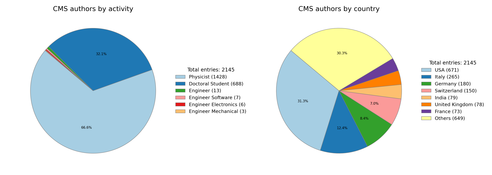

# CMS Members Geodata

This repository provides geospatial data and tools to visualize the geographic distribution of CMS collaboration members. It imports institutional locations and maps them interactively using OpenStreetMap.

## Overview

The project collects latitude and longitude coordinates of CMS member institutes worldwide and generates interactive maps to display their global distribution. These maps help analyze CMS collaboration's geographical reach and institutional diversity.

## 🔧 Prerequisites

This project is built using Jupyter Notebooks and the following Python libraries are used, all installable via `conda-forge`.

  

  
  
  
  
  

## 🗺️ Data Sources and Map Credits

- **Country-level map shapefiles**  
  Natural Earth 1:110m Admin 0 – Countries  
  [Natural Earth Data](https://www.naturalearthdata.com/downloads/110m-cultural-vectors/110m-admin-0-countries/)  
  *(Files located in `offline-country-level-mapdata/`)*

- **Basemap Sources**
The interactive maps use the following base layers:
-- **CartoDB Voyager** : Tiles from [CartoDB Voyager](https://carto.com/attributions) with attribution to OpenStreetMap contributors and CartoDB.
-- **OpenStreetMap** : Tiles provided by [OpenStreetMap](https://www.openstreetmap.org) contributors.

- **CMS Members Data**  
People: [iCMS: People](https://icms.cern.ch/tools/collaboration/people)  
Institutes: [iCMS: Institutes](https://icms.cern.ch/tools/collaboration/institutes)
Data extracted on 22/05/2025

## 📊 Features

- Import and process CMS member institute data with geographic coordinates.
- Generate interactive maps using OpenStreetMap.
- Display individual institutes as points on the map.
- Maps are recognized by the United Nations; note that acceptance by individual countries may vary.

## 📈 Summary of Visualizations

### Bar plots
  
*Bar plots showing the number of CMS institutes and collaborators per country.*

### Pie Charts
  
*Pie charts detailing the composition of authors within CMS collaborators by activity at CERN (left) and affiliated country (right).*

  
*Pie charts comparing the fraction of CMS collaborators by activity at CERN who are authors (left) and non-authors (right).*

### Bubble Maps
  
*A bubble map showing CMS collaborators (authors) worldwide, with bubble sizes proportional to the number of people per location.*

  
*A bubble map showing CMS-affiliated institutes worldwide, with bubble sizes proportional to the number of institutes per location.*

### Heat Maps
  
*A heatmap illustrating the geographic density of CMS collaborators (authors).*

  
**A heatmap illustrating the geographic density of CMS institutes.*

## 📥Interactive map

The interactive map shows the geographic locations of CMS collaboration institutes worldwide using base tiles from OpenStreetMap and CartoDB Voyager. Each institute is marked based on its latitude and longitude, with popups displaying details like name, town, and country. The map allows switching between base layers and is recognized by the United Nations, though individual countries may view it differently.

#### You can download the full interactive map here:  ⬇️

