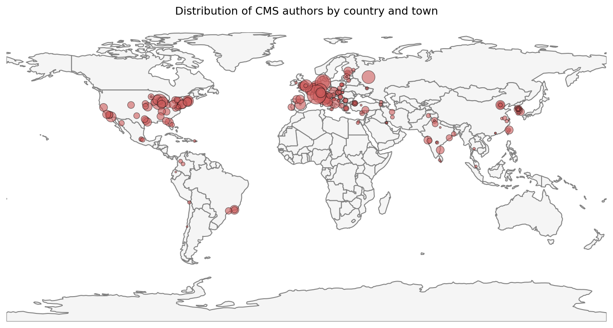
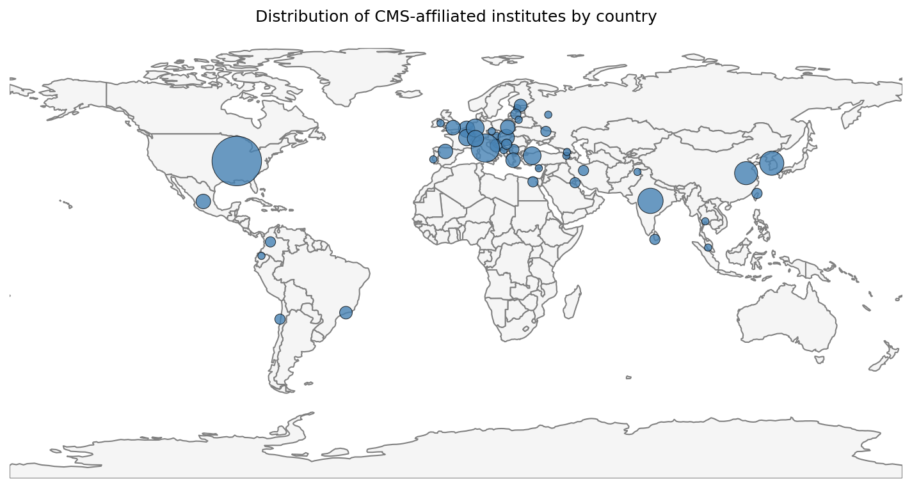

# CMS Members Geodata

This repository provides geospatial data and tools to visualize the geographic distribution of CMS collaboration members. It imports institutional locations and maps them interactively using OpenStreetMap.

## Overview

The project collects latitude and longitude coordinates of CMS member institutes worldwide and generates interactive maps to display their global distribution. These maps help analyze CMS collaboration's geographical reach and institutional diversity.

## Data Sources and Map Credits

- **Country-level map shapefiles**  
  Natural Earth 1:110m Admin 0 – Countries  
  [Natural Earth Data](https://www.naturalearthdata.com/downloads/110m-cultural-vectors/110m-admin-0-countries/)  
  *(Files located in `offline-country-level-mapdata/`)*

- **Basemap Sources**
The interactive maps use the following base layers:
-- **CartoDB Voyager** : Tiles from [CartoDB Voyager](https://carto.com/attributions) with attribution to OpenStreetMap contributors and CartoDB.
-- **OpenStreetMap** : Tiles provided by [OpenStreetMap](https://www.openstreetmap.org) contributors.

- **CMS Members Data**  
Members contact and people data: [iCMS: People](https://icms.cern.ch/tools/collaboration/people)  
Institutes information: [iCMS: Institutes](https://icms.cern.ch/tools/collaboration/institutes)

## Features

- Import and process CMS member institute data with geographic coordinates.
- Generate interactive maps using OpenStreetMap.
- Display individual institutes as points on the map.
- Maps are recognized by the United Nations; note that acceptance by individual countries may vary.

## Summary of Visualizations

### Bar Plot of Institutes per Country
  
*A bar plot showing the number of CMS institutes per country or region.*

### Pie Charts
  
*A pie chart detailing the composition of authors within CMS collaborators by activity at CERN and affiliated country.*

  
*A pie chart comparing the fraction of CMS collaborators who are authors versus non-authors by activity at CERN.*

### Bubble Maps
  
*A bubble map showing CMS authors across the world, with bubble sizes proportional to the number of people per location.*

  
*A bubble map showing CMS-affiliated institutes worldwide, with bubble sizes proportional to the number of institutes per location.*

### Heat Maps
  
*A heatmap illustrating the geographic density of CMS collaborators (authors).*

  
*A heatmap indicating the global distribution density of CMS institutes.*
